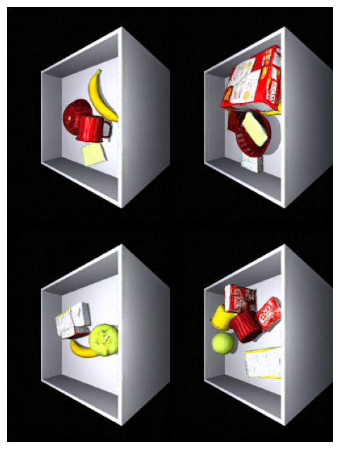

# Diffusion Models: ‘Unconditional and Conditional Approaches to Image Synthesis’

This is repository for exploring and implementing diffusion models to generate high-quality 2D RGB images using the YCB dataset. This project includes unconditioned and conditioned models, evaluated through both quantitative metrics and human assessments.

## Overview
This project allows you to train three diffusion models. The first scenario is the unconditioned case, second the diffusion model is conditioned on depth and the third the diffusion model is conditioned on a semantic map.
The original data is about 14,000 .mat files which is about 158 GB and is stored in BEAR (Birmingham Environment for Academic Research), which contains High Performance Computers, this data was ran on a 40GB GPU, experiments took typically 8 hours.
For ease of running I have provided 1,000 .mat files. The file size is about 10.4 GB. This is designed to run a 8GB GPU.

For training an experiment will take 30 minutes per epoch, for 40 epochs it is about 20 hours. This time per epoch has been reduced to less than 15 minutes by introducing a virtual data size. What this means is that rather than seeing the whole data every epoch, it only sees some of the data (the data specified as the virtual data size). It would instead see all the data over multiple epochs. The advantage of this is speed. Another advantage is better generalisation, as it introduces some form of new data every epoch, which changes the data it sees, which prevents it from overfitting.
The training scripts currently has settings to run for two epochs, this can be adjusted for more epochs to get better results, the models were typically trained for 40 epochs.
However, in this case, to get it to run we significantly undersampled to get this to run in a reasonable time for an 8GB GPU hence we underfit unless we run it for significantly longer than 40 epochs.



## Requirements
Package requirements are covered in the requirements.txt file.
However, you will need to create a huggingface account.
The scripts are .ipynb files, VS Code is advised.

## Setup Instructions

### 1. Clone the Repository
```bash
git clone https://git.cs.bham.ac.uk/projects-2023-24/oia295.git
cd oia295
```
### 2. Create and activate a conda environment
You can call it my_env, gen_env or any environment you want.
```bash
conda create --name gen_env python=3.8
conda activate gen_env
```
### 3. Install Dependencies
```bash
pip install -r requirements.txt
```
### 4. Download Dataset

Download dataset from the link and unzip it, let 'mixed_data_set' be on the same level as the code:
https://drive.google.com/drive/folders/1prSW5ODfHPDRBODJgfd5IQYwPT9oyMB0?usp=sharing

### 5. Setting up Hugging Face Account
1.  Create an account
- If you don't have a Hugging Face account, you can sign up here: huggingface.co
2. Generate an access token
- Click on your profile in top right hand corner, then click on 'Settings' 
- Then Choose 'Access Tokens'
- Create a token with 'Write' permissions


### 6. Setting Up Hugging Face Token
1. Create a file named 'hf_token.txt' in the project root directory (i.e. at the same level that the .ipynb files exist)
2. Paste your Hugging Face token into this file


### 7. Running Generate Script

If you want to generate images using the three already pretrained models. Open 'generate.ipynb' and run the cells.


### 8. Running Training Scripts - Modifying the DDPM Pipeline

If you want to run the training script from scratch, you will first need to make some modifications.

1. Your Denoising Diffusion Probabilistic Pipeline which comes from HuggingFace will need to be modified to work for the conditional case where you are feeding 4 channels (RBD + Depth or RGB + Class Segmentation Map) and the model predicts 3 channels (RGB). This is the easiest way, rather than creating a separate file, as there are a number relative call functionalities within the diffusers module where the pipeline is referenced.

2. Navigate to your version of the following folder:
C:\Users\<name>\anaconda3\envs\<your_env>\Lib\site-packages\diffusers\pipelines\ddpm
e.g.
C:\Users\isaac\anaconda3\envs\my_env\Lib\site-packages\diffusers\pipelines\ddpm

Open 'pipeline_ddpm.py' and replace the contents with:

```bash
# Copyright 2024 The HuggingFace Team. All rights reserved.
#
# Licensed under the Apache License, Version 2.0 (the "License");
# you may not use this file except in compliance with the License.
# You may obtain a copy of the License at
#
#     http://www.apache.org/licenses/LICENSE-2.0
#
# Unless required by applicable law or agreed to in writing, software
# distributed under the License is distributed on an "AS IS" BASIS,
# WITHOUT WARRANTIES OR CONDITIONS OF ANY KIND, either express or implied.
# See the License for the specific language governing permissions and
# limitations under the License.


from typing import List, Optional, Tuple, Union

import torch

from ...utils.torch_utils import randn_tensor
from ..pipeline_utils import DiffusionPipeline, ImagePipelineOutput


class DDPMPipeline(DiffusionPipeline):
    r"""
    Pipeline for image generation.

    This model inherits from [`DiffusionPipeline`]. Check the superclass documentation for the generic methods
    implemented for all pipelines (downloading, saving, running on a particular device, etc.).

    Parameters:
        unet ([`UNet2DModel`]):
            A `UNet2DModel` to denoise the encoded image latents.
        scheduler ([`SchedulerMixin`]):
            A scheduler to be used in combination with `unet` to denoise the encoded image. Can be one of
            [`DDPMScheduler`], or [`DDIMScheduler`].
    """

    model_cpu_offload_seq = "unet"

    def __init__(self, unet, scheduler):
        super().__init__()
        self.register_modules(unet=unet, scheduler=scheduler)

    @torch.no_grad()
    def __call__(
        self,
        batch_size: int = 1,
        generator: Optional[Union[torch.Generator, List[torch.Generator]]] = None,
        num_inference_steps: int = 1000,
        output_type: Optional[str] = "pil",
        return_dict: bool = True,
        val_dataloader: torch.utils.data.DataLoader = None
    ) -> Union[ImagePipelineOutput, Tuple]:
        r"""
        The call function to the pipeline for generation.

        Args:
            batch_size (`int`, *optional*, defaults to 1):
                The number of images to generate.
            generator (`torch.Generator`, *optional*):
                A [`torch.Generator`](https://pytorch.org/docs/stable/generated/torch.Generator.html) to make
                generation deterministic.
            num_inference_steps (`int`, *optional*, defaults to 1000):
                The number of denoising steps. More denoising steps usually lead to a higher quality image at the
                expense of slower inference.
            output_type (`str`, *optional*, defaults to `"pil"`):
                The output format of the generated image. Choose between `PIL.Image` or `np.array`.
            return_dict (`bool`, *optional*, defaults to `True`):
                Whether or not to return a [`~pipelines.ImagePipelineOutput`] instead of a plain tuple.

        Example:

        ```py
        >>> from diffusers import DDPMPipeline

        >>> # load model and scheduler
        >>> pipe = DDPMPipeline.from_pretrained("google/ddpm-cat-256")

        >>> # run pipeline in inference (sample random noise and denoise)
        >>> image = pipe().images[0]

        >>> # save image
        >>> image.save("ddpm_generated_image.png")
        ```

        Returns:
            [`~pipelines.ImagePipelineOutput`] or `tuple`:
                If `return_dict` is `True`, [`~pipelines.ImagePipelineOutput`] is returned, otherwise a `tuple` is
                returned where the first element is a list with the generated images
        """
        if val_dataloader is None:
            # Sample gaussian noise to begin loop
            if isinstance(self.unet.config.sample_size, int):
                image_shape = (
                    batch_size,
                    self.unet.config.in_channels,
                    self.unet.config.sample_size,
                    self.unet.config.sample_size,
                )
            else:
                image_shape = (batch_size, self.unet.config.in_channels, *self.unet.config.sample_size)

            if self.device.type == "mps":
                # randn does not work reproducibly on mps
                image = randn_tensor(image_shape, generator=generator)
                image = image.to(self.device)
            else:
                image = randn_tensor(image_shape, generator=generator, device=self.device)

            # set step values
            self.scheduler.set_timesteps(num_inference_steps)

            for t in self.progress_bar(self.scheduler.timesteps):
                # 1. predict noise model_output
                model_output = self.unet(image, t).sample

                # 2. compute previous image: x_t -> x_t-1
                image = self.scheduler.step(model_output, t, image, generator=generator).prev_sample

            image = (image / 2 + 0.5).clamp(0, 1)
            image = image.cpu().permute(0, 2, 3, 1).numpy()
            if output_type == "pil":
                image = self.numpy_to_pil(image)

            if not return_dict:
                return (image,)

            return ImagePipelineOutput(images=image)
        
        else:
            for batch in val_dataloader:
                depthImage = batch[:, -1, :, :].unsqueeze(1).to(self.device)
                break


            # Sample gaussian noise to begin loop
            if isinstance(self.unet.config.sample_size, int):
                image_shape = (
                    batch_size,
                    self.unet.config.out_channels,
                    self.unet.config.sample_size,
                    self.unet.config.sample_size,
                )
            else:
                image_shape = (batch_size, self.unet.config.out_channels, *self.unet.config.sample_size)

            if self.device.type == "mps":
                # randn does not work reproducibly on mps
                image = randn_tensor(image_shape, generator=generator) 
                image = image.to(self.device)
            else:
                image = randn_tensor(image_shape, generator=generator, device=self.device)

            # set step values
            self.scheduler.set_timesteps(num_inference_steps)

            for t in self.progress_bar(self.scheduler.timesteps):
                # 1. predict noise model_output
                input_image = torch.cat([image, depthImage], dim=1)
                model_output = self.unet(input_image, t).sample

                # 2. compute previous image: x_t -> x_t-1
                image = self.scheduler.step(model_output, t, image, generator=generator).prev_sample

            image = (image / 2 + 0.5).clamp(0, 1)
            image = image.cpu().permute(0, 2, 3, 1).numpy()
            if output_type == "pil":
                image = self.numpy_to_pil(image)

            if not return_dict:
                return (image,)

            return ImagePipelineOutput(images=image)
```


### 9. Running the Training Notebooks

Using VS Code, you can run any of the three models presented as a '.ipynb' files.
The three scripts are:
1. unconditioned.ipynb
2. condition_depth.ipynb
3. condition_labels.ipynb

These scripts have the number of epochs they run for to be set to two epochs, these can be adjusted to run for much longer epochs. To develop the models on the project, they were trained for 40 epochs.
Feel free to work through the code cells.


### 10. Visualisations
A local output folder with generated images will have been created at the end of training which you can view in the file directory.
The names of these file depending on which training notebook you run would be called 
Also this is viewwable on Hugging Face along with the logs of what was recorded. Just click on your profile or go to https://huggingface.co/<insert your user name>


### References
Portions of the code in this repository are adapted from the Hugging Face Diffusers tutorial:

Hugging Face Team. "Train a diffusion model." Available at: https://huggingface.co/docs/diffusers/en/tutorials/basic_training. Licensed under the Apache 2.0 License.
Inspiration and techniques for the diffusion model are drawn from the following paper:

Ho, J., Jain, A., & Abbeel, P. (2020). Denoising Diffusion Probabilistic Models. arXiv preprint arXiv:2006.11239v2. Available at: https://doi.org/10.48550/arXiv.2006.11239.
